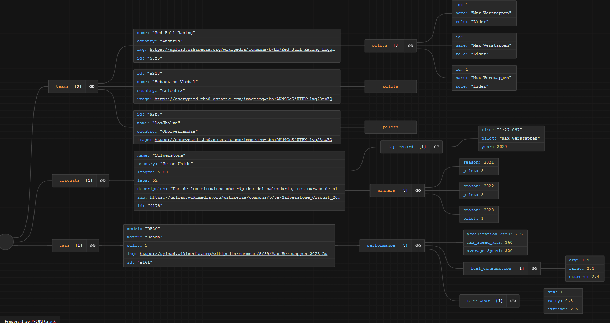

# Proyecto F1 Vite Simulation

Este es un proyecto de simulación de Fórmula 1 desarrollado con Vite, que utiliza JSON Server como backend simulado y Spline para objetos 3D. El sistema permite la creación, eliminación, edición y consulta de circuitos, equipos, pilotos y vehículos, además de simular una carrera con tiempos y vueltas.

## Tecnologías utilizadas
- [Vite](https://vitejs.dev/)
- [JSON Server](https://github.com/typicode/json-server)
- [Spline](https://spline.design/)
- [Node.js](https://nodejs.org/)

## Instalación

Clona el repositorio e instala las dependencias:

```bash
# Clonar el repositorio
git clone https://github.com/Designedby-Radol/f1Simulation.git
cd  f1Simulation

# Instalar dependencias
npm install
```

## Uso

Para iniciar el servidor de desarrollo de Vite junto con JSON Server:
```bash
npm run dev
```

## Estructura del Proyecto

```
docs/
  archive.txt
  squema.json
node_modules/
public/
src/
  api/
    circuitsApi.js
    teamsApi.js
    vehiclesApi.js
  components/
    carComponent/
    circuitComponents/
    pilotsComponents/
    simulationComponent/
    teamComponents/
    mainComponent.js
    managementComponent.js
    playGame.js
  css/
  services/
    f1WhiteLogo.svg
    javascript.svg
  main.js
.gitignore
db.json
index.html
package-lock.json
package.json
README.md
```

## Esquema de Datos (JSON)



```json
{
    "teams": [
        {
            "name": "Red Bull Racing",
            "country": "Austria",
            "pilots": [
                { "id": 1, "name": "Max Verstappen", "role": "Líder" }
            ],
            "img": "https://upload.wikimedia.org/wikipedia/commons/b/bb/Red_Bull_Racing_Logo.svg",
            "id": "53c5"
        }
    ],
    "circuits": [
        {
            "name": "Silverstone",
            "country": "Reino Unido",
            "length": 5.89,
            "laps": 52,
            "lap_record": { "time": "1:27.097", "pilot": "Max Verstappen", "year": 2020 },
            "winners": [ { "season": 2021, "pilot": 3 } ],
            "img": "https://upload.wikimedia.org/wikipedia/commons/5/5e/Silverstone_Circuit_2020_layout.png",
            "id": "9178"
        }
    ],
    "cars": [
        {
            "model": "RB20",
            "motor": "Honda",
            "pilot": 1,
            "performance": {
                "acceleration_ZtoH": 2.5,
                "max_speed_kmh": 360,
                "average_Speed": 320
            },
            "img": "https://upload.wikimedia.org/wikipedia/commons/8/89/Max_Verstappen_2023_Austria_FP2_%28cropped%29.jpg",
            "id": "e161"
        }
    ]
}
```


## Licencia

Este proyecto está bajo la licencia MIT. Consulta el archivo `LICENSE` para más detalles.

